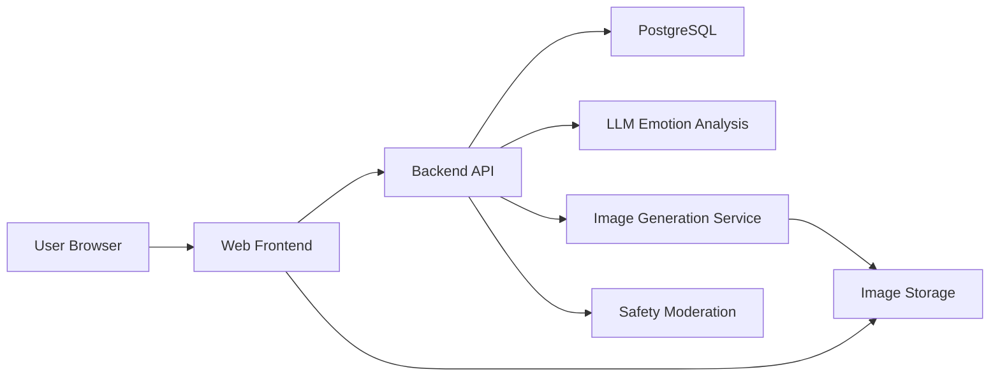

# Moomo 沐哞 軟體開發規格書
版本：1.0

## 1. 專案概述

### 1.1 專案名稱

Moomo 沐哞

### 1.2 專案定位

Moomo 沐哞 是一個以「私密情緒樹洞」為核心的網頁應用。使用者可以輸入生活中的抱怨、不滿、壓力或負面情緒，系統透過 LLM 分析文字情緒與具象化關鍵元素，將情緒轉化成一隻會變化、可互動、可收藏、可分享的「發瘋小怪獸」。

產品目標不是取代心理諮商，而是提供一個低門檻、私密、有趣的情緒釋放入口，讓使用者把沉重情緒轉化為觀察怪獸變異的好奇心，並透過治癒任務逐步建立情緒調節習慣。

### 1.3 核心概念

- 使用者輸入的情緒與碎碎念。
- 由情緒生成並隨互動演化的小怪獸。
- 負面能量：怪獸吸收抱怨後累積的狀態值。
- 正面值：透過治癒任務或安撫互動增加的狀態值。
- 治癒任務：簡單、具體、易於完成的線下行動。
- 日記回顧：記錄一段養成期間的情緒變化與怪獸最終樣貌。
- 匿名交流區：分享怪獸與討論的社群空間。

## 2. 專案目標與成功指標

### 2.1 專案目標

1. 提供使用者安全、私密、低壓力的情緒輸入空間。
2. 將負面情緒視覺化為具個人特色的小怪獸，增加趣味與陪伴感。
3. 透過 LLM 回覆提供即時情緒價值，而不是冷冰冰的紀錄工具。
4. 透過治癒任務引導使用者進行情緒轉換。
5. 透過日記與回顧功能讓使用者看見自己的情緒週期。
6. 透過匿名交流區促進分享，但避免暴露個人隱私。

### 2.2 MVP 成功指標

- 使用者可以完成「輸入抱怨 -> 生成/改變怪獸 -> 收到回覆 -> 完成任務 -> 看到怪獸狀態變化」的完整流程。
- LLM 能穩定回傳可解析 JSON，包含主要情緒、情緒強度、具象化元素、回覆文字、圖像生成 prompt。
- 怪獸至少支援顏色、角、表情、頭飾、臉部配件、身體配件等變化。
- 任務系統可根據怪獸負面值切換任務數量。
- 使用者可將舊怪獸封存到日記並開始新怪獸。
- 交流區可匿名分享怪獸、查看貼文、留言討論。

## 3. 使用者與情境

### 3.1 主要使用者

- 生活壓力大、需要私密抒發空間的學生或年輕上班族。
- 不想把負能量丟給朋友，但需要被理解的人。
- 喜歡養成、收藏、角色變化、社群分享的使用者。

### 3.2 使用情境

- 使用者下課或下班後想抱怨今天發生的不如意。
- 使用者不想被熟人知道情緒狀況，因此選擇匿名、私密輸入。
- 使用者想知道自己最近常出現哪些情緒。
- 使用者看到小怪獸狀態太差，因此完成一個簡單任務讓牠變好。
- 使用者養成一段時間後，把怪獸封存成日記並分享最終樣貌。

## 4. 系統範圍

### 4.1 MVP 範圍

- 使用者帳號與登入。
- 情緒輸入框。
- LLM 情緒分析與情緒價值回覆。
- 小怪獸生成與外觀演化。
- 怪獸心情值、負面值、正面值管理。
- 治癒任務列表、完成、放棄。
- 配件獎勵與裝備限制。
- 日記封存與回顧。
- 匿名交流區分享、貼文列表、留言。
- 基本設定頁。

### 4.2 非 MVP 範圍

- 怪獸之間自動互動。
- 完整行動 App。
- 專業心理健康診斷。
- 真實任務驗證，例如定位、健康資料串接、拍照辨識。
- 付費道具、商店、抽卡。

## 5. 產品限制與原則

1. 本產品需明確標示不提供醫療診斷或危機處理服務。
2. 若偵測到自傷、傷人、急迫危機內容，系統應中止一般怪獸化回覆，改提供危機資源與求助建議。
3. 交流區預設匿名，不顯示真實姓名、Email 或完整個人識別資訊。
4. 使用者輸入的私密日記內容預設不公開；分享時只分享怪獸、摘要或使用者自行選擇的文字。
5. LLM 回覆應以陪伴、接住情緒、輕量引導為主，避免說教、責備或診斷。

## 6. 主要使用流程

### 6.1 初次使用流程

1. 使用者進入網站。
2. 系統顯示登入或匿名試用入口。
3. 使用者建立第一隻小怪獸。
4. 系統顯示主畫面：怪獸、情緒輸入框、任務入口、圖鑑/日記、交流區、設定。
5. 怪獸主動問候，例如「今天心情怎麼樣？」

### 6.2 情緒餵食流程

1. 使用者在輸入框輸入今日抱怨或不如意事件。
2. 前端送出文字至後端。
3. 後端呼叫 LLM 進行情緒分析。
4. LLM 回傳主要情緒、情緒強度、具象化元素、回覆、圖像 prompt、配件建議。
5. 系統更新怪獸：
   - 生氣可出現紅角。
   - 憂鬱可變藍色。
   - 提到學校可生成背包等身體配件。
6. 系統增加怪獸負面值。
7. 前端顯示怪獸變化與情緒價值回覆。
8. 若負面值超過門檻，系統增加治癒任務數量。

### 6.3 治癒任務流程

1. 使用者進入任務區。
2. 系統顯示 1 至 2 個一般任務；若怪獸負面值超過 50%，顯示 4 至 5 個任務。
3. 使用者選擇完成或放棄任務。
4. 若完成任務：
   - 怪獸正面值增加。
   - 負面值下降或心情值往正向移動。
   - 使用者有機率獲得配件獎勵。
5. 若放棄任務：
   - 任務可被移除或重新分配。
   - 不給予獎勵。

### 6.4 安撫怪獸流程

1. 怪獸因累積抱怨而心情變差。
2. 使用者可輸入安慰、鼓勵或哄怪獸的話。
3. 系統分析此輸入是否為正向安撫。
4. 若成立，怪獸正面值增加，並可能回覆使用者。

### 6.5 日記封存流程

1. 每隻怪獸最少養成一天。
2. 超過一天後，使用者可選擇繼續養成或養新怪獸。
3. 若選擇養新怪獸，舊怪獸加入日記。
4. 日記包含：
   - 養育日期，例如 3/23-4/25。
   - 期間情緒變化。
   - 情緒類別統計。
   - 出現最多的情緒。
   - 怪獸最終樣貌。
   - 主要配件與演化記錄。

### 6.6 匿名交流區流程

1. 使用者選擇分享怪獸。
2. 系統產生分享卡片，包含怪獸圖像、暱稱、情緒摘要、配件亮點。
3. 使用者可選擇是否附上文字描述。
4. 貼文發布至匿名交流區。
5. 其他使用者可查看、留言、按讚或收藏。

## 7. 功能需求

### 7.1 帳號系統

| 編號 | 功能 | 說明 | 優先級 |
| --- | --- | --- | --- |
| FR-001 | 註冊 | 使用 Email 或第三方登入建立帳號 | P1 |
| FR-002 | 登入/登出 | 支援安全登入與登出 | P1 |
| FR-003 | 匿名暱稱 | 交流區顯示匿名暱稱，不顯示真實帳號 | P1 |
| FR-004 | 刪除帳號 | 使用者可刪除帳號與資料 | P2 |

### 7.2 情緒輸入

| 編號 | 功能 | 說明 | 優先級 |
| --- | --- | --- | --- |
| FR-101 | 情緒文字輸入 | 使用者可輸入抱怨、壓力、不滿或安撫文字 | P1 |
| FR-102 | 輸入長度限制 | MVP 建議 1 至 1000 字 | P1 |
| FR-103 | 歷史紀錄 | 儲存每次輸入的時間、文字、分析結果 | P1 |
| FR-104 | 危機內容偵測 | 偵測自傷、傷人、危急語句並提供求助資源 | P1 |

### 7.3 LLM 情緒分析

| 編號 | 功能 | 說明 | 優先級 |
| --- | --- | --- | --- |
| FR-201 | 主要情緒判定 | 分析主要情緒，例如生氣、憂鬱、焦慮、委屈、疲憊 | P1 |
| FR-202 | 情緒強度 | 回傳 0 至 100 的情緒強度 | P1 |
| FR-203 | 具象元素抽取 | 抽取學校、工作、朋友、考試、天氣等可視覺化元素 | P1 |
| FR-204 | 情緒價值回覆 | 產生接住情緒、陪伴感的回覆 | P1 |
| FR-205 | 圖像生成 Prompt | 產生可交給生圖模型使用的怪獸 prompt | P1 |
| FR-206 | JSON 格式輸出 | 後端必須能解析且驗證 schema | P1 |

### 7.4 小怪獸生成與演化

| 編號 | 功能 | 說明 | 優先級 |
| --- | --- | --- | --- |
| FR-301 | 初始怪獸 | 建立使用者的當前怪獸，初始心情值中立 | P1 |
| FR-302 | 情緒外觀變化 | 依情緒變更顏色、角、表情、眼睛、嘴型等 | P1 |
| FR-303 | 具象元素配件 | 依文字元素新增配件，例如學校對應背包 | P1 |
| FR-304 | 負面值累積 | 抱怨餵食後增加怪獸負面值 | P1 |
| FR-305 | 正面值恢復 | 任務或安撫互動後增加正面值 | P1 |
| FR-306 | 配件部位限制 | 頭飾、臉部、身體各部位同時最多一個配件 | P1 |
| FR-307 | 最終樣貌保存 | 封存怪獸時保存最終圖像與配件狀態 | P1 |

### 7.5 治癒任務

| 編號 | 功能 | 說明 | 優先級 |
| --- | --- | --- | --- |
| FR-401 | 任務庫 | 系統內建治癒任務，例如喝喜歡的飲料、散步、整理桌面 | P1 |
| FR-402 | 任務分配 | 一般狀態顯示 1 至 2 個任務 | P1 |
| FR-403 | 高負面狀態任務 | 負面值超過 50% 時顯示 4 至 5 個任務 | P1 |
| FR-404 | 任務完成 | 使用者可自行標記完成 | P1 |
| FR-405 | 任務放棄 | 使用者可放棄任務 | P2 |
| FR-406 | 完成獎勵 | 完成後增加正面值並可能獲得配件 | P1 |

### 7.6 日記與回顧

| 編號 | 功能 | 說明 | 優先級 |
| --- | --- | --- | --- |
| FR-501 | 養成天數限制 | 怪獸至少養一天才能封存 | P1 |
| FR-502 | 建立新怪獸 | 使用者可在封存舊怪獸後開始新怪獸 | P1 |
| FR-503 | 日記列表 | 顯示歷史怪獸列表 | P1 |
| FR-504 | 情緒統計 | 顯示養成期間最多的情緒類別 | P1 |
| FR-505 | 心情變化 | 顯示期間情緒趨勢 | P2 |
| FR-506 | 最終樣貌 | 顯示怪獸封存時的最終圖像 | P1 |

### 7.7 匿名交流區

| 編號 | 功能 | 說明 | 優先級 |
| --- | --- | --- | --- |
| FR-601 | 分享怪獸 | 使用者可一鍵分享怪獸卡片 | P1 |
| FR-602 | 貼文列表 | 顯示匿名怪獸分享貼文 | P1 |
| FR-603 | 留言討論 | 使用者可匿名留言 | P1 |
| FR-604 | 按讚 | 使用者可對貼文按讚 | P2 |
| FR-605 | 檢舉 | 使用者可檢舉不當內容 | P1 |
| FR-606 | 內容審核 | 系統應阻擋或標記危害、仇恨、個資內容 | P1 |

### 7.8 設定

| 編號 | 功能 | 說明 | 優先級 |
| --- | --- | --- | --- |
| FR-701 | 暱稱設定 | 修改交流區暱稱 | P2 |
| FR-702 | 隱私設定 | 控制是否允許分享日記摘要 | P2 |
| FR-703 | 資料匯出 | 匯出個人日記資料 | P3 |
| FR-704 | 刪除資料 | 刪除情緒紀錄或日記 | P2 |

## 8. AI 分析規格

### 8.1 LLM 輸入

```json
{
  "userId": "user_123",
  "monsterId": "monster_456",
  "text": "今天在學校被老師罵，真的超生氣。",
  "currentMonsterState": {
    "moodScore": -20,
    "negativeEnergy": 35,
    "positiveEnergy": 10,
    "accessories": {
      "head": null,
      "face": null,
      "body": "backpack"
    }
  },
  "locale": "zh-TW"
}
```

### 8.2 LLM 輸出 JSON Schema

```json
{
  "primaryEmotion": "anger",
  "secondaryEmotions": ["frustration", "sadness"],
  "emotionIntensity": 78,
  "sentimentScore": -65,
  "isComfortingMonster": false,
  "concreteKeywords": [
    {
      "text": "學校",
      "category": "place",
      "visualElement": "backpack"
    },
    {
      "text": "老師",
      "category": "person",
      "visualElement": "tiny notebook"
    }
  ],
  "monsterChanges": {
    "baseColor": "red",
    "horn": "small red horns",
    "expression": "angry but cute",
    "aura": "sparks",
    "suggestedAccessory": {
      "slot": "body",
      "name": "school backpack",
      "reason": "使用者提到學校"
    }
  },
  "reply": "聽起來你今天真的被狠狠戳到，會生氣很合理。先把這口氣交給小怪獸吞掉，牠現在長出紅角了。",
  "imagePrompt": "A cute chaotic emotional monster, red body, small red horns, angry but adorable expression, wearing a school backpack, soft digital pet style, transparent background.",
  "safetyFlag": {
    "level": "none",
    "reason": null
  }
}
```

### 8.3 情緒類別

| 代碼 | 中文 | 外觀方向 |
| --- | --- | --- |
| anger | 生氣 | 紅色、角、火花、皺眉 |
| sadness | 難過 | 藍色、下垂耳朵、眼淚 |
| anxiety | 焦慮 | 抖動線條、放大眼睛、毛刺 |
| fatigue | 疲憊 | 灰色、眼袋、軟趴姿勢 |
| frustration | 挫折 | 裂紋、凌亂毛髮 |
| loneliness | 孤單 | 小陰影、抱著物件 |
| embarrassment | 尷尬 | 粉色臉頰、遮臉 |
| neutral | 中立 | 初始造型 |
| comfort | 安撫 | 柔和顏色、亮點、微笑 |

### 8.4 危機內容處理

若 `safetyFlag.level` 為 `self_harm`、`harm_others` 或 `crisis`：

1. 不生成搞笑怪獸回覆。
2. 顯示支持性文字與求助建議。
3. 提供當地緊急資源或建議聯絡可信任的人。
4. 後端記錄安全事件類型，但避免過度保存敏感原文。

## 9. 怪獸狀態規格

### 9.1 狀態值

| 欄位 | 範圍 | 說明 |
| --- | --- | --- |
| moodScore | -100 至 100 | 整體心情，0 為中立 |
| negativeEnergy | 0 至 100 | 累積負面能量 |
| positiveEnergy | 0 至 100 | 累積正面能量 |
| level | 1 以上 | 養成等級，依互動次數與天數增加 |

### 9.2 狀態更新規則

- 每次抱怨輸入：`negativeEnergy += emotionIntensity * 0.15`。
- 每次抱怨輸入：`moodScore -= emotionIntensity * 0.10`。
- 完成治癒任務：`positiveEnergy += taskReward`。
- 完成治癒任務：`negativeEnergy -= taskReward * 0.6`。
- 安撫成功：`moodScore += 5 至 15`。
- 所有值需限制在定義範圍內。

### 9.3 配件限制

| 部位 | 範例 | MVP 限制 |
| --- | --- | --- |
| head | 帽子、角、髮飾 | 同時最多一個 |
| face | 眼鏡、貼紙、眼淚 | 同時最多一個 |
| body | 衣服、背包、披風 | 同時最多一個 |

若新配件與現有配件部位衝突，使用者可選擇替換或保留原配件。MVP 可先採自動替換並提供提示。

## 10. 資料模型

### 10.1 User

| 欄位 | 型別 | 說明 |
| --- | --- | --- |
| id | string | 使用者 ID |
| email | string | 登入 Email |
| displayName | string | 站內名稱 |
| anonymousName | string | 交流區匿名名稱 |
| createdAt | datetime | 建立時間 |
| updatedAt | datetime | 更新時間 |

### 10.2 Monster

| 欄位 | 型別 | 說明 |
| --- | --- | --- |
| id | string | 怪獸 ID |
| userId | string | 所屬使用者 |
| name | string | 怪獸名稱 |
| status | enum | active, archived |
| moodScore | number | 心情值 |
| negativeEnergy | number | 負面值 |
| positiveEnergy | number | 正面值 |
| baseColor | string | 主要顏色 |
| appearanceJson | json | 外觀描述 |
| imageUrl | string | 當前怪獸圖像 |
| startedAt | datetime | 開始養成時間 |
| archivedAt | datetime | 封存時間 |

### 10.3 EmotionEntry

| 欄位 | 型別 | 說明 |
| --- | --- | --- |
| id | string | 紀錄 ID |
| userId | string | 使用者 ID |
| monsterId | string | 怪獸 ID |
| rawText | text | 使用者輸入 |
| primaryEmotion | string | 主要情緒 |
| secondaryEmotions | json | 次要情緒 |
| emotionIntensity | number | 情緒強度 |
| llmReply | text | AI 回覆 |
| analysisJson | json | 完整分析結果 |
| createdAt | datetime | 建立時間 |

### 10.4 Accessory

| 欄位 | 型別 | 說明 |
| --- | --- | --- |
| id | string | 配件 ID |
| userId | string | 所屬使用者 |
| monsterId | string | 所屬怪獸 |
| slot | enum | head, face, body |
| name | string | 配件名稱 |
| source | enum | emotion, task, reward |
| equipped | boolean | 是否裝備 |
| createdAt | datetime | 取得時間 |

### 10.5 HealingTask

| 欄位 | 型別 | 說明 |
| --- | --- | --- |
| id | string | 任務 ID |
| title | string | 任務標題 |
| description | string | 任務描述 |
| category | string | 任務分類 |
| rewardValue | number | 正面值獎勵 |
| difficulty | enum | easy, normal |
| active | boolean | 是否啟用 |

### 10.6 UserTask

| 欄位 | 型別 | 說明 |
| --- | --- | --- |
| id | string | 使用者任務 ID |
| userId | string | 使用者 ID |
| monsterId | string | 怪獸 ID |
| taskId | string | 任務 ID |
| status | enum | assigned, completed, abandoned |
| assignedAt | datetime | 分配時間 |
| completedAt | datetime | 完成時間 |

### 10.7 Diary

| 欄位 | 型別 | 說明 |
| --- | --- | --- |
| id | string | 日記 ID |
| userId | string | 使用者 ID |
| monsterId | string | 怪獸 ID |
| startDate | date | 養成開始日期 |
| endDate | date | 養成結束日期 |
| emotionSummaryJson | json | 情緒統計 |
| finalImageUrl | string | 最終樣貌 |
| createdAt | datetime | 建立時間 |

### 10.8 CommunityPost

| 欄位 | 型別 | 說明 |
| --- | --- | --- |
| id | string | 貼文 ID |
| userId | string | 發文者 |
| monsterId | string | 分享怪獸 |
| anonymousName | string | 匿名名稱 |
| imageUrl | string | 分享圖 |
| caption | text | 貼文文字 |
| likeCount | number | 讚數 |
| createdAt | datetime | 建立時間 |

### 10.9 Comment

| 欄位 | 型別 | 說明 |
| --- | --- | --- |
| id | string | 留言 ID |
| postId | string | 貼文 ID |
| userId | string | 留言者 |
| anonymousName | string | 匿名名稱 |
| content | text | 留言內容 |
| createdAt | datetime | 建立時間 |

## 11. API 規格

### 11.1 認證

| Method | Path | 說明 |
| --- | --- | --- |
| POST | `/api/auth/register` | 註冊 |
| POST | `/api/auth/login` | 登入 |
| POST | `/api/auth/logout` | 登出 |
| GET | `/api/me` | 取得目前使用者 |

### 11.2 怪獸

| Method | Path | 說明 |
| --- | --- | --- |
| GET | `/api/monsters/current` | 取得當前怪獸 |
| POST | `/api/monsters` | 建立新怪獸 |
| PATCH | `/api/monsters/:id` | 更新怪獸名稱或外觀 |
| POST | `/api/monsters/:id/archive` | 封存怪獸到日記 |

### 11.3 情緒輸入

| Method | Path | 說明 |
| --- | --- | --- |
| POST | `/api/emotions` | 送出情緒文字並觸發分析 |
| GET | `/api/emotions?monsterId=:id` | 取得怪獸期間的情緒紀錄 |

`POST /api/emotions` request:

```json
{
  "monsterId": "monster_456",
  "text": "今天在學校被老師罵，真的超生氣。"
}
```

response:

```json
{
  "entryId": "entry_789",
  "reply": "聽起來你今天真的被狠狠戳到...",
  "monster": {
    "id": "monster_456",
    "moodScore": -28,
    "negativeEnergy": 47,
    "imageUrl": "/images/monster_456.png"
  },
  "analysis": {
    "primaryEmotion": "anger",
    "emotionIntensity": 78
  },
  "newTaskCount": 2
}
```

### 11.4 任務

| Method | Path | 說明 |
| --- | --- | --- |
| GET | `/api/tasks/current?monsterId=:id` | 取得目前任務 |
| POST | `/api/tasks/assign` | 分配任務 |
| POST | `/api/user-tasks/:id/complete` | 完成任務 |
| POST | `/api/user-tasks/:id/abandon` | 放棄任務 |

### 11.5 日記

| Method | Path | 說明 |
| --- | --- | --- |
| GET | `/api/diaries` | 取得日記列表 |
| GET | `/api/diaries/:id` | 取得日記詳情 |

### 11.6 交流區

| Method | Path | 說明 |
| --- | --- | --- |
| GET | `/api/community/posts` | 取得貼文列表 |
| POST | `/api/community/posts` | 分享怪獸 |
| GET | `/api/community/posts/:id` | 取得貼文詳情 |
| POST | `/api/community/posts/:id/comments` | 新增留言 |
| POST | `/api/community/posts/:id/like` | 按讚 |
| POST | `/api/community/posts/:id/report` | 檢舉 |

## 12. 介面需求

### 12.1 主畫面

主畫面需包含：

- 中央怪獸顯示區。
- 情緒輸入框，placeholder 可為「想說些什麼......」。
- 送出按鈕。
- 怪獸即時回覆區。
- 目前心情狀態或能量條。
- 任務入口。
- 圖鑑/日記入口。
- 交流區入口。
- 設定入口。

### 12.2 任務畫面

任務畫面需包含：

- 任務標題。
- 任務描述，例如「在杯底找回一點點快樂」、「喝一杯喜歡的飲料」。
- 完成按鈕。
- 放棄按鈕。
- 任務獎勵提示。

### 12.3 日記畫面

日記畫面需包含：

- 歷史怪獸卡片列表。
- 養成日期。
- 最常出現的情緒。
- 怪獸最終樣貌。
- 點入後可看詳細情緒統計。

### 12.4 交流區畫面

交流區需包含：

- 匿名貼文列表。
- 怪獸圖片。
- 分享文字。
- 留言數、按讚數。
- 留言輸入框。
- 檢舉入口。

## 13. 技術架構

### 13.1 建議形式

優先開發網頁版，原因：

- 跨作業系統使用成本低。
- 串接 LLM 與生圖服務較容易。
- 開發、部署、展示速度較快。

### 13.2 建議技術棧

| 層級 | 建議 |
| --- | --- |
| Frontend | React / Next.js |
| Backend | Next.js API Routes 或 Node.js Express |
| Database | PostgreSQL |
| ORM | Prisma |
| Auth | NextAuth 或自建 JWT Session |
| Storage | S3-compatible object storage 或本機開發儲存 |
| LLM | Gemini 或其他支援 JSON 輸出的模型 |
| Image Generation | Gemini 圖像生成或其他可用生圖 API |
| Deployment | Vercel / Render / Railway |

### 13.3 系統架構



## 14. 非功能需求

### 14.1 效能

- 一般頁面首次載入應小於 3 秒。
- 情緒分析 API 若需等待 LLM，目標回應時間小於 10 秒。
- 圖像生成可採非同步，若超過 10 秒，前端顯示生成中狀態。

### 14.2 可用性

- 主要流程需支援桌機與手機瀏覽器。
- 情緒輸入、任務完成、分享流程需在 3 次點擊內完成。
- 錯誤訊息需友善，不顯示模型或後端原始錯誤。

### 14.3 安全

- 密碼不得明文儲存。
- API Key 只能存在後端環境變數。
- 私密情緒紀錄不得被其他使用者讀取。
- 交流區需過濾個資、仇恨、騷擾、自傷鼓勵等內容。

### 14.4 隱私

- 分享功能預設不分享原始情緒文字。
- 使用者可刪除自己的情緒紀錄與日記。
- 日記與情緒輸入預設為私人資料。

### 14.5 可靠性

- LLM 回傳非 JSON 時，後端需重試或 fallback。
- 圖像生成失敗時，使用規則式怪獸外觀作為備援。
- 任務完成與怪獸狀態更新需使用交易，避免資料不一致。

## 15. 驗收標準

### 15.1 情緒輸入與分析

- Given 使用者輸入一段抱怨文字，When 按下送出，Then 系統應儲存紀錄並顯示 AI 回覆。
- Given LLM 回傳主要情緒為 anger，When 系統更新怪獸，Then 怪獸應出現生氣對應外觀變化。
- Given 輸入文字包含「學校」，When 分析完成，Then 系統可產生或建議學校相關配件。

### 15.2 怪獸狀態

- Given 怪獸初始心情為中立，When 使用者多次輸入抱怨，Then 負面值應逐步上升。
- Given 使用者完成治癒任務，When 任務狀態更新為 completed，Then 怪獸正面值應增加。
- Given 同一部位已有配件，When 新配件加入，Then 系統不得同時裝備兩個同部位配件。

### 15.3 治癒任務

- Given 怪獸負面值低於 50%，When 使用者進入任務區，Then 顯示 1 至 2 個任務。
- Given 怪獸負面值超過 50%，When 使用者進入任務區，Then 顯示 4 至 5 個任務。
- Given 使用者完成任務，When 後端處理成功，Then 使用者有機率取得配件獎勵。

### 15.4 日記

- Given 怪獸養成未滿一天，When 使用者嘗試封存，Then 系統應提示尚未達成封存條件。
- Given 怪獸養成超過一天，When 使用者封存，Then 系統應建立日記並保存最終樣貌。

### 15.5 交流區

- Given 使用者分享怪獸，When 發布成功，Then 其他使用者可在交流區看到匿名貼文。
- Given 使用者留言，When 留言發布成功，Then 留言不得顯示真實帳號資訊。
- Given 貼文被檢舉，When 系統收到檢舉，Then 管理端或審核流程應可追蹤。

## 16. 測試計畫

### 16.1 單元測試

- 情緒狀態更新函式。
- 任務分配規則。
- 配件部位限制。
- LLM JSON schema 驗證。
- 日記統計計算。

### 16.2 整合測試

- 情緒輸入 API 到 LLM 分析再到怪獸更新。
- 任務完成 API 到怪獸狀態更新。
- 封存怪獸到日記。
- 分享怪獸到交流區。

### 16.3 E2E 測試

- 新使用者建立怪獸並完成第一次情緒輸入。
- 使用者輸入多次負面情緒後觸發更多治癒任務。
- 使用者完成任務並獲得配件。
- 使用者封存怪獸並在日記看到回顧。
- 使用者分享怪獸並在交流區留言。

### 16.4 AI 測試

- 測試常見情緒：生氣、難過、焦慮、疲憊、委屈。
- 測試具象化詞彙：學校、老師、考試、公司、朋友、雨天。
- 測試輸出是否符合 JSON schema。
- 測試危機文字是否觸發安全流程。
- 測試模型失敗或超時的 fallback。

## 17. 開發里程碑

### Milestone 1：基礎框架與資料結構

- 建立前後端專案。
- 建立資料庫 schema。
- 完成登入與當前使用者。
- 完成初始怪獸建立。

### Milestone 2：情緒分析與怪獸演化

- 串接 LLM。
- 完成情緒輸入 API。
- 完成怪獸狀態更新。
- 完成基本外觀變化。

### Milestone 3：治癒任務與配件

- 建立任務庫。
- 完成任務分配規則。
- 完成任務完成/放棄。
- 完成配件獎勵與部位限制。

### Milestone 4：日記與回顧

- 完成怪獸封存。
- 完成日記列表與詳情。
- 完成情緒統計。

### Milestone 5：匿名交流區

- 完成怪獸分享。
- 完成貼文列表。
- 完成留言與按讚。
- 完成檢舉與基本審核。

### Milestone 6：整合、測試與展示

- 完成 E2E 流程。
- 補齊錯誤處理。
- 優化 UI 與行動版版面。
- 準備 Demo 資料。

## 18. 風險與對策

| 風險 | 影響 | 對策 |
| --- | --- | --- |
| LLM 輸出格式不穩 | 後端解析失敗 | 使用 JSON schema、重試、fallback |
| 圖像生成耗時過長 | 使用者等待過久 | 非同步生成、顯示 loading、快取結果 |
| 情緒資料敏感 | 隱私風險 | 預設私人、最小化分享、支援刪除 |
| 危機內容處理不當 | 使用者安全風險 | 建立安全偵測與求助資源流程 |
| 交流區內容失控 | 社群品質下降 | 檢舉、審核、敏感內容過濾 |
| MVP 範圍過大 | 開發延期 | 先完成核心循環，再補社群與圖像品質 |

## 19. MVP 優先開發清單

1. 使用者登入與建立當前怪獸。
2. 情緒輸入框與 LLM JSON 分析。
3. 怪獸狀態值與外觀文字/圖片變化。
4. 治癒任務列表、完成任務、增加正面值。
5. 配件獎勵與部位限制。
6. 日記封存與基本情緒統計。
7. 匿名交流區的分享與留言。
8. 危機內容安全流程。

## 20. 未來擴充方向

- 怪獸之間互相交流。
- 更細緻的怪獸動畫。
- 個人情緒週報。
- 任務推薦個人化。
- 更多配件分類與圖鑑收藏。
- 好友或小圈圈分享。
- 行動 App 與推播提醒。
- 使用者自訂怪獸名稱與房間。

